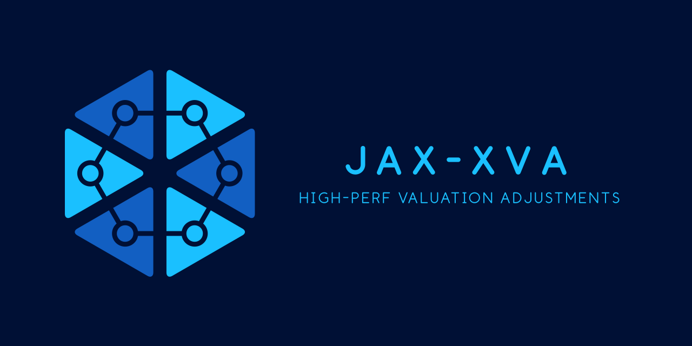

# JAX XVA Library

A high-performance library for XVA (Valuation Adjustments) calculations using JAX.

## Overview

This library provides efficient implementations of various XVA components using JAX's high-performance features:

- **Just-in-time (JIT) compilation**: Accelerates calculations by compiling functions
- **Automatic differentiation**: Enables efficient calculation of sensitivities and Greeks
- **Vectorization**: Fast parallel computation of simulations and valuation steps
- **GPU/TPU acceleration**: Transparent hardware acceleration for compute-intensive tasks

## Key Features (In Progress)

- Comprehensive XVA calculations (CVA, DVA, FVA, MVA, KVA)
- Exposure simulation for various trade types
- Efficient Monte Carlo simulation
- Portfolio aggregation with netting
- Risk sensitivities calculation
- Performance benchmarking capabilities

## Components

### XVA Components (In Progress)

- **CVA (Credit Valuation Adjustment)**: Adjustment for counterparty credit risk
- **DVA (Debt Valuation Adjustment)**: Adjustment for own credit risk
- **FVA (Funding Valuation Adjustment)**: Adjustment for funding costs
- **MVA (Margin Valuation Adjustment)**: Adjustment for initial margin costs
- **KVA (Capital Valuation Adjustment)**: Adjustment for capital costs
- **ColVA (Collateral Valuation Adjustment)**: Adjustment for collateral costs/benefits

### Market Models

- **Hull-White Model**: One-factor interest rate model for simulating rate paths
- **Black-Scholes Model**: Model for equity and FX underlyings

### Exposure Calculation

- **Exposure Simulator**: Simulates future exposure profiles
- **Exposure Calculator**: Utilities for exposure calculations and interpolation

### Risk Management Tools

- **XVA Engine**: Main engine orchestrating XVA calculations
- **Sensitivity Analysis**: Calculation of risk sensitivities using auto-differentiation
- **Stress Testing**: Framework for running stress scenarios

<!-- ## Installation

```bash
pip install jax-xva
``` -->

## Quick Start

```python
import jax
import jax.numpy as jnp
from jax import random

from jax_xva import (
    MarketData, SwapTradeData, SimulationConfig,
    HullWhiteModel, XVAEngine, create_sample_market_data
)

# Create market data
market_data = create_sample_market_data()

# Configure simulation
sim_config = SimulationConfig(
    n_paths=1000,
    n_time_steps=40,
    time_horizon=5.0,
    random_seed=42
)

# Create models
models = {
    'interest_rate': HullWhiteModel(mean_reversion=0.03, volatility=0.01)
}

# Define trades
trades = [
    SwapTradeData(
        trade_id="Swap_1",
        counterparty="Counterparty_A",
        start_date=0.0,
        end_date=5.0,
        notional=1_000_000.0,
        fixed_rate=0.025,
        payment_frequency=0.5,
        is_payer=True
    )
]

# Create XVA engine
xva_engine = XVAEngine(market_data, sim_config)

# Simulate exposures
exposures = xva_engine.simulate_portfolio_exposures(
    random.PRNGKey(42), trades, models)

# Define netting sets
netting_sets = {"NS_1": ["Swap_1"]}

# Aggregate exposures
aggregated = xva_engine.aggregate_exposures(exposures, netting_sets)

# Calculate XVA components
xva_results = xva_engine.calculate_portfolio_xva(
    counterparty="Counterparty_A",
    own_entity="Bank",
    exposures=aggregated
)

# Print results
print(f"CVA: ${xva_results['CVA']:.2f}")
print(f"FVA: ${xva_results['FVA']:.2f}")
print(f"Total XVA: ${xva_results['TotalXVA']:.2f}")
```

## Performance

TODO: Benchmark against numpy and c++


## Citation

If you use this library in your research, please cite:

```
@software{jax_xva_library,
  author = {XVA Library Contributors},
  title = {JAX XVA: High-Performance XVA Calculations with JAX},
  year = {2025},
  url = {https://github.com/ebrahimpichka/jax-xva}
}
```